# MANAS360 Staging Architecture (Low-Cost VPS / Lightsail)

## Auto-detected stack
- Frontend framework: React 19 + React Router 6 + Vite 6 + Tailwind CSS
- Backend framework: Node.js + Express 4
- Languages: TypeScript + JavaScript
- Build tools: Vite, PostCSS, Jest
- Package manager: npm (`package-lock.json`)
- Database: PostgreSQL (`pg` driver, `DATABASE_URL`)
- Env config: `.env`, `.env.local`, `.env.example`, plus staged env files in this plan
- Existing deployment artifacts: `Dockerfile.backend`, `Dockerfile.frontend`, `docker-compose.yml`, GitHub workflows

---

## Target folder structure

```text
deploy/staging/
  docker/
    Dockerfile.backend
    Dockerfile.frontend
    Dockerfile.nginx
  nginx/
    nginx.conf
    conf.d/
      default.conf
      frontend-spa.conf
    upstreams/
      frontend_active.conf
      backend_active.conf
  scripts/
    server-setup.sh
    deploy-green.sh
    switch-color.sh
    rollback.sh
    init-letsencrypt.sh
    renew-letsencrypt.sh
  docker-compose.staging.yml
```

Additional root files:
- `.env.development`
- `.env.staging`
- `.env.production`
- `.github/workflows/staging-blue-green.yml`

---

## Deployment workflow diagram

```mermaid
flowchart LR
  A[Push to develop] --> B[GitHub Actions Build]
  B --> C[Push images to GHCR]
  C --> D[SSH to Lightsail VPS]
  D --> E[Deploy inactive color containers]
  E --> F[Health checks]
  F --> G[Switch Nginx upstream blue/green]
  G --> H[Nginx reload]
  H --> I[Zero downtime live traffic]
  I --> J[Rollback available on previous color]
```



---

## Blue-Green staging architecture
- Public entrypoint: `nginx` (`80/443`) only
- Private containers: `frontend_blue`, `frontend_green`, `backend_blue`, `backend_green`, `postgres`
- Nginx routes:
  - `/` -> active frontend color
  - `/api` -> active backend color
- Backend and DB are **not exposed to public ports**
- All application containers communicate over internal Docker network

---

## Step-by-step server setup (Lightsail)

### 1) Initial VPS prep
```bash
cd /opt
git clone <YOUR_REPO_URL> manas360
cd manas360
bash deploy/staging/scripts/server-setup.sh
# then re-login to apply docker group
```

### 2) Configure staging environment
```bash
cp .env.staging .env.staging.local
# edit values (POSTGRES_PASSWORD, JWT secrets, DOMAIN, etc.)
```

### 3) Start base stack
```bash
docker compose -f deploy/staging/docker-compose.staging.yml --env-file .env.staging up -d
```

### 4) Provision SSL certificate
```bash
bash deploy/staging/scripts/init-letsencrypt.sh staging.example.com devops@example.com
```

### 5) Switch active color manually (if needed)
```bash
bash deploy/staging/scripts/switch-color.sh blue
bash deploy/staging/scripts/switch-color.sh green
```

### 6) Rollback instantly
```bash
bash deploy/staging/scripts/rollback.sh
```

### 7) Schedule cert renewal
```bash
(crontab -l 2>/dev/null; echo "0 3 * * * cd /opt/manas360 && bash deploy/staging/scripts/renew-letsencrypt.sh") | crontab -
```

---

## CI/CD behavior (`develop` branch)
- Trigger: push to `develop`
- Builds frontend/backend multi-stage images
- Pushes images to GHCR with version tags (`v<run_number>`, `latest`)
- SSH deploy to VPS
- Deploys inactive color (green/blue opposite)
- Health-checks backend container
- Switches Nginx upstream to new color
- Keeps previous color running for immediate rollback

Required GitHub Secrets:
- `STAGING_HOST`
- `STAGING_USER`
- `STAGING_SSH_KEY`

---

## Security best practices implemented
- No direct DB port published
- No direct backend port published
- Public access only via Nginx reverse proxy
- Internal Docker network (`internal: true`) for service-to-service traffic
- TLS termination in Nginx
- Blue/green switch done by upstream change + Nginx reload

---

## Zero-downtime strategy
1. Determine active color.
2. Deploy new image to inactive color only.
3. Run health checks on inactive backend.
4. Update Nginx upstream files to inactive color.
5. Reload Nginx (no process restart downtime).
6. Keep previous color alive for rollback.

---

## Database migration strategy (VPS -> Managed DB later)

### Current state
- Postgres runs inside same VPS Docker host.

### Future target
- Managed DB service (AWS RDS PostgreSQL / managed equivalent).

### No-data-loss migration plan
1. **Pre-migration backup baseline**
   - `pg_dump -Fc` full logical backup.
   - Validate restore into temporary DB.
2. **Set migration window policy**
   - staging: short maintenance or dual-write test.
   - production: controlled cutover, write freeze during final sync.
3. **Provision managed DB**
   - Create instance, parameter groups, security groups.
4. **Initial load**
   - Restore backup into managed DB:
     - `pg_restore --clean --if-exists -d <managed_db>`
5. **Delta sync approach**
   - Option A: brief write freeze + final dump/restore delta.
   - Option B: logical replication for near-zero downtime.
6. **Cutover**
   - Update `DATABASE_URL` in `.env.staging`/`.env.production`.
   - Restart only backend color being deployed next.
7. **Validation**
   - Run smoke tests + API health + key transactional paths.
8. **Rollback-ready window**
   - Keep old local DB untouched until validation complete.
9. **Decommission local DB**
   - After successful soak period + backup retention policy.

### Backup/restore commands (PostgreSQL)
```bash
# Backup
docker exec -t manas360-postgres pg_dump -U "$POSTGRES_USER" -d "$POSTGRES_DB" -Fc > backup_$(date +%F_%H%M).dump

# Restore (example)
pg_restore --clean --if-exists -h <managed-host> -U <user> -d <db> backup_2026-02-26_0300.dump
```

---

## Migration checklist
- [ ] Confirm schema migrations are versioned and repeatable
- [ ] Take verified backup from VPS DB
- [ ] Restore backup to managed DB test target
- [ ] Run integration tests against managed DB
- [ ] Freeze writes (or enable logical replication)
- [ ] Perform final sync
- [ ] Update `DATABASE_URL` for staging
- [ ] Deploy inactive color with new DB URL
- [ ] Health-check + smoke test
- [ ] Switch traffic
- [ ] Monitor errors/latency 24h
- [ ] Retain old DB snapshot before decommission

---

## Notes
- This package is staging-ready and production-forward.
- For production, replicate this with stricter IAM, secrets manager, WAF/CDN, and managed observability.
